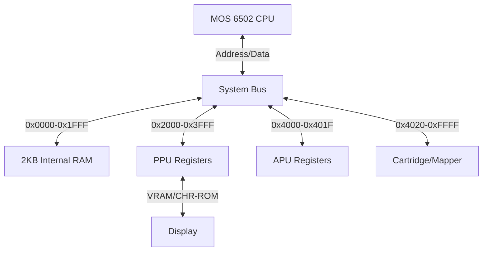

# MochaNES Architecture Reference

## 1. System Bus Overview

The NES is a bus-based architecture. The `NES.java` class acts as the motherboard, routing signals between components.

---

## 2. The CPU Core (`CPU.java`)
The CPU is a cycle-accurate emulation of the **Ricoh 2A03** (NTSC) / **2A07** (PAL).

### 2.1 Cycle Timing
*   **Instruction Accurate**: The CPU logic (`executeNextInstruction`) executes one full instruction at a time but counts exact cycles (e.g., `LDA #10` = 2 cycles).
*   **Page Crossing**: The emulator correctly adds +1 cycle penalty for branch taken and page-crossings during indexing.
*   **DMA Theft**: When OAM DMA triggers (writing to `$4014`), the CPU is suspended for **513-514 cycles** while the APU copies 256 bytes to the PPU OAM.

### 2.2 Interrupt Handling
The 6502 has three interrupt vectors:
1.  **NMI (Non-Maskable Interrupt)** (`$FFFA`): Triggered by the PPU at the start of VBlank. Used for graphics updates.
2.  **RESET** (`$FFFC`): Triggered on power-up.
3.  **IRQ / BRK** (`$FFFE`): Triggered by Mappers (Scanline counters) or the APU (Frame Counter).

**NMI Hijacking**:
A subtle hardware bug in the 6502 is emulated:
> If an NMI occurs *during* the vector fetch of a BRK or IRQ, the CPU will jump to the NMI vector instead, but the stack will show the flags for the BRK/IRQ.

---

## 3. The PPU Core (`PPU.java`)
The **Pixel Processing Unit (2C02)** is the most complex component, running at 3x the CPU speed (5.37 MHz).

### 3.1 Loopy's Scrolling Logic
The PPU does not use simple X/Y coordinates. It uses internal latches (V, T, X, W) discovered by the emulator author "Loopy".
*   **v**: Current VRAM address (15 bits).
*   **t**: Temporary VRAM address (15 bits).
*   **x**: Fine X Scroll (3 bits).
*   **w**: Write Toggle (1 bit).

Writes to `$2005` (Scroll) and `$2006` (Address) update these latches partially. This allows for mid-frame splitscreen effects (e.g., status bars in *Super Mario Bros 3*).

### 3.2 Rendering Pipeline
The PPU renders the screen Scanline by Scanline (0-261).
*   **Cycles 0-256**: Visible Rendering.
    *   Fetches Tile ID -> Attribute -> Pattern Low -> Pattern High.
    *   Shifter registers slide pixel data out every cycle.
*   **Cycles 257-320**: Sprite Fetching for *Next* Scanline.
*   **Scanline 241**: Sets VBlank Flag (`$2002.7`) and triggers NMI.

---

## 4. The Mapper Subsystem (`Memory.java`)
Mappers extend the NES capabilities by bank-switching memory.

### Supported Mappers
*   **NROM (0)**: No mapping. 32KB PRG, 8KB CHR.
*   **MMC1 (1)**: *Zelda, Metroid*. Shift-register based banking. Supports Mirroring changes.
*   **UxROM (2)**: *Castlevania, Mega Man*. Fixed lower bank, switchable upper bank.
*   **CNROM (3)**: *Cybernoid*. CHR-ROM banking.
*   **MMC3 (4)**: *Mario 3, Kirby*. Scanline IRQ counter based on PPU A12 toggles.

---

## 5. State Management (Smart Forking)
For AI training, the emulator supports **Fast State Cloning**.
*   **`loadState(Component src)`**: Every component implements this interface.
*   **Optimization**: We use `System.arraycopy` for large buffers (RAM/VRAM) and direct field assignment for registers.
*   **Performance**: A full clone takes ~50 microseconds, allowing the AI to fork thousands of times per second.
