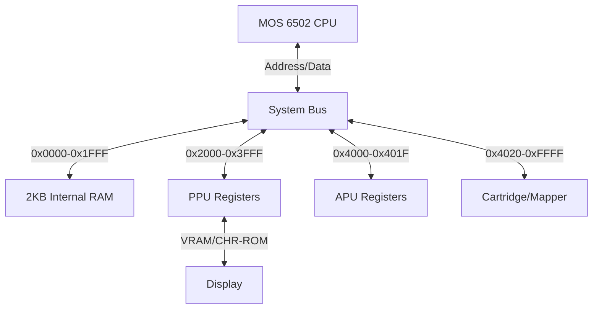

# MochaNES Architecture Reference

How the emulator is put together, and the design decisions that are not obvious
from reading the classes.

For how correct it is and how that is measured, see the
[Accuracy Report](Accuracy.md). For the hardware documentation behind these
decisions — the [NESdev Wiki](https://www.nesdev.org/wiki/Nesdev_Wiki) above
all — see [References](References.md).

---

## 1. System Bus Overview

The NES is a bus-based architecture. `NES.java` acts as the motherboard, routing
signals between components.



---

## 2. The Clock Model

This is the piece worth understanding first, because everything else hangs off
it.

On real hardware the CPU, PPU and APU run concurrently: the PPU advances three
dots for every CPU cycle. A naive emulator runs a whole CPU instruction and then
"catches up" the other chips. That is simpler, but it means a game reading
`$2002` mid-instruction sees PPU state from the wrong moment.

**Every 6502 cycle is a bus access.** So the clock is driven from `Memory`: each
`read()` and `write()` advances the PPU by three dots and the APU by one cycle
before the access is performed. The video and audio state an instruction
observes is therefore correct *at that cycle*.

```java
// Memory.read / Memory.write
tickCycle();          // PPU x3, APU x1, sample interrupt lines
// ... perform the access ...
```

`NES.stepInstruction()` is the single definition of a system step, shared by the
runners and the test harness:

1. Execute one CPU instruction (its bus accesses drive the clock).
2. Make up any cycles the CPU charged for that performed no bus access —
   internal operations — so totals stay exact.
3. Service an interrupt latched during the instruction.

Two consequences worth knowing:

* **`Memory.peek()` exists** for the debugger, disassembler and execution hooks.
  It reads without consuming a cycle. Using `read()` from those paths would
  inject phantom cycles and skew timing.
* **The APU must not call `read()`.** Its DMC sample fetch runs inside
  `apu.tick()`, which is itself driven by the clock; a `read()` there would
  re-enter the clock and dilate time. It uses `peek()`, and the DMA's cycle cost
  is applied separately by `stepInstruction()`.

### 2.1 Power-on alignment

The CPU and PPU come out of reset at a fixed but arbitrary relative phase, and
everything the VBlank-timing tests measure is relative to it. `NES.reset()`
advances the clock by a small number of cycles to match hardware. That count is
*measured, not derived*: every `$2002` read of `ppu_vbl_nmi/02-vbl_set_time` was
traced and diffed against Mesen, and the committed value is the one that keeps
the two in step longest.

---

## 3. The CPU Core (`CPU.java`)

An emulation of the **Ricoh 2A03** (NTSC), covering official and unofficial
opcodes.

### 3.1 Cycle timing

Per-instruction cycle counts are exact — verified by blargg's `instr_timing`,
which sweeps every opcode. Page-crossing and branch-taken penalties are applied,
and unofficial opcodes carry their real costs.

Instruction *boundaries* are exact; the CPU does not model where within an
instruction each internal operation falls. That distinction is what the
remaining timing-test failures come down to (see the Accuracy Report).

### 3.2 Interrupts

Three vectors: **NMI** (`$FFFA`), **RESET** (`$FFFC`), **IRQ/BRK** (`$FFFE`).

The 6502 decides whether to take an interrupt from the line state at the **end
of the second-to-last cycle** of an instruction, not from the state once it has
finished. An interrupt asserted on the final cycle therefore waits for the next
instruction. `NES` keeps the previous cycle's sample to reproduce this.

NMI is edge-triggered: the edge is latched as it happens and serviced at the
next instruction boundary.

**Interrupt-disable latency** — `CLI`, `SEI` and `PLP` change the I flag *after*
the interrupt poll, so one pending IRQ still gets through after them. Missing
this on `SEI` was a real bug; `cpu_interrupts_v2/1-cli_latency` catches it.

**NMI hijacking** — if an NMI arrives during BRK's first few cycles, the CPU
vectors through `$FFFA` while the stack still shows BRK's flags.

### 3.3 DMA

Writing `$4014` suspends the CPU for 513-514 cycles while 256 bytes are copied
to OAM. The DMC's sample fetch is a second, smaller DMA: it halts the CPU for
about four cycles each time it pulls a byte. Games with heavy DMC use are timed
around this.

---

## 4. The PPU Core (`PPU.java`)

The **2C02** runs at 3x the CPU clock (5.37 MHz), 341 dots per scanline, 262
scanlines per frame.

### 4.1 Loopy's scrolling registers

The PPU does not track X/Y directly. It uses internal latches:

* **v** — current VRAM address (15 bits)
* **t** — temporary VRAM address (15 bits)
* **x** — fine X scroll (3 bits)
* **w** — write toggle (1 bit)

Writes to `$2005` and `$2006` update these partially, which is what makes
mid-frame split-screen effects possible (the status bar in *Super Mario Bros 3*).

### 4.2 Background pipeline

Per visible scanline, in eight-dot groups: nametable byte → attribute byte →
pattern low → pattern high, with the shifters reloaded every eight dots and
`incrementScrollX` at the end of each group. `incrementScrollY` fires at dot 256,
`transferAddressX` at 257, and `transferAddressY` across dots 280-304 of the
pre-render line.

### 4.3 Sprites

Hardware evaluates sprites **once per scanline** into an 8-entry secondary OAM
and fetches their pattern bytes during the same period. The emulator does the
same, at dot 257 for the following line.

This matters for both accuracy and speed. Scanning all 64 sprites per pixel —
with two VRAM reads each — is the single most expensive thing a naive renderer
does, and it also silently ignores the hardware 8-sprite limit, so the overflow
flag never sets and sprites hardware would drop still get drawn.

### 4.4 Edge cases that games depend on

* **Left-column clipping** — mask bits 1 and 2 blank the leftmost 8 pixels for
  background and sprites independently. Games use this while scrolling to hide
  the partial tile sliding in from the left; without it that column is garbage.
  Kirby's Adventure clips it permanently, which is why a strip of backdrop
  colour there is correct rather than a bug.
* **Open bus** — the `$2002` low bits come from a decaying latch, per bit. An
  access refreshes only the bits it drives, so reading `$2002` refreshes bits
  7-5 and reading a write-only register refreshes nothing.
* **`$2007` read buffer** — in the palette range, palette RAM answers the CPU
  directly while the bus still carries the nametable byte mirrored underneath.
  That byte, not the palette entry, is what gets buffered.
* **Odd-frame skip** — with rendering enabled, the pre-render line is one dot
  short on odd frames.
* **VBlank race** — reading `$2002` right as the flag is raised suppresses the
  flag, the NMI, or both, depending on the exact dot.

---

## 5. The APU Core (`APU.java`)

Two pulse channels, triangle, noise and DMC, mixed with the hardware's
non-linear formula.

### 5.1 Output chain

Channel outputs accumulate every CPU cycle and are averaged down to 44.1kHz.
That average is only a box filter, so the mixed signal then goes through the
filter chain real hardware has: high-pass at 90Hz, high-pass at 440Hz, low-pass
at **14kHz**. The low-pass is not cosmetic — without it, harmonics above Nyquist
fold back as aliasing and the top end sounds gritty.

### 5.2 Pacing

`line.write()` blocks once the output buffer is full, and that is what paces the
emulator to 60Hz. The buffer therefore doubles as the only thing absorbing
jitter from GC or a slow repaint; it is sized at ~93ms for that reason.

If no audio device exists — a CI runner, a headless box — the emulator runs
silently rather than failing. Note that it then loses its pacing source and will
run unthrottled.

---

## 6. The Mapper Subsystem (`Memory.java`)

| # | Name | Examples | Notes |
|---|------|----------|-------|
| 0 | NROM | *Super Mario Bros, Donkey Kong* | No banking |
| 1 | MMC1 | *Zelda, Metroid* | Shift-register banking, mirroring control |
| 2 | UxROM | *Mega Man, Castlevania* | Switchable low bank, fixed high bank |
| 3 | CNROM | — | CHR banking only |
| 4 | MMC3 | *Super Mario Bros 3, Kirby* | PRG/CHR banking + scanline IRQ |
| 7 | AxROM | — | 32KB banks, single-screen mirroring |

Anything outside this set reads open bus for its reset vector and spins on
`BRK` with a blank screen. The `Detected Mapper: N` line printed at load is the
quickest way to check — **do not infer the mapper from the `roms/` folder name**,
which does not match.

### MMC3 scanline IRQ

Driven by A12 rising edges. During rendering these land once per scanline, so
the counter is clocked from the PPU at a fixed dot; while rendering is off, A12
transitions from CPU-driven `$2006`/`$2007` writes clock it instead. This is
what drives the *SMB3* status-bar split.

---

## 7. State Management

Every component implements fast cloning, used for save states and for AI
rollouts.

* `System.arraycopy` for large buffers (RAM, VRAM, CHR), direct field assignment
  for registers.
* A full clone takes tens of microseconds.
* **Anything added to a component's state must be added to all four paths** —
  `copy`, `fastCopyFrom`, `saveState`, `loadState` — or it will silently fail to
  survive a clone.
